[](https://raw.githubusercontent.com/NVIDIA/FastPhotoStyle/master/LICENSE.md)


## FastPhotoStyle

### MLDS hw3 - Style Transfer

b03901023 許秉鈞


### Experimental Result

| 原圖             | 套入的風格       | 結果             |
| ---------------- | ---------------- | ---------------- |
| 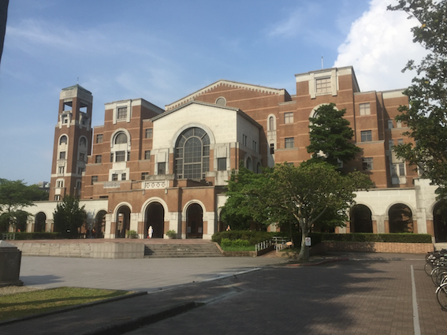 |  | 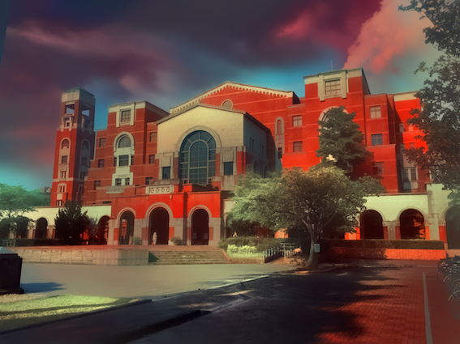 |
| 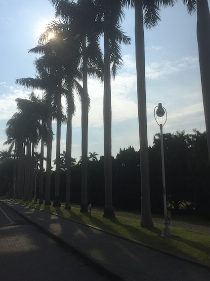 | 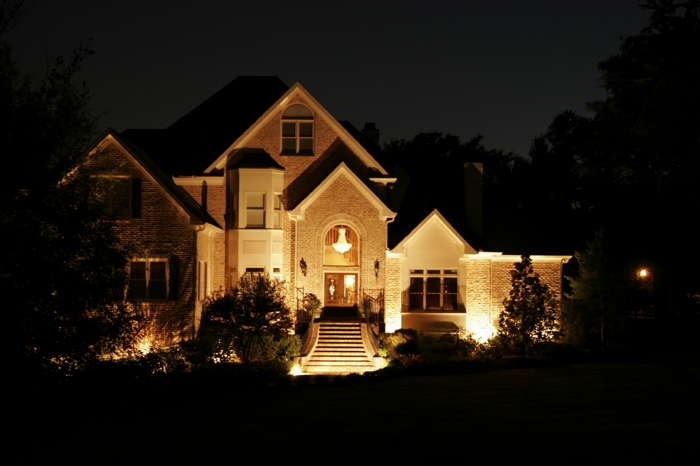 | 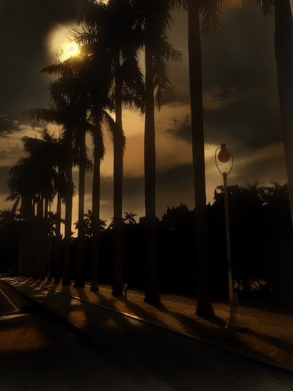 |
| 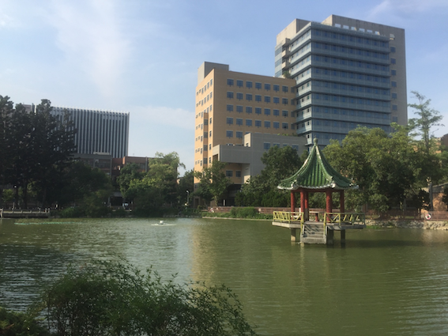 | 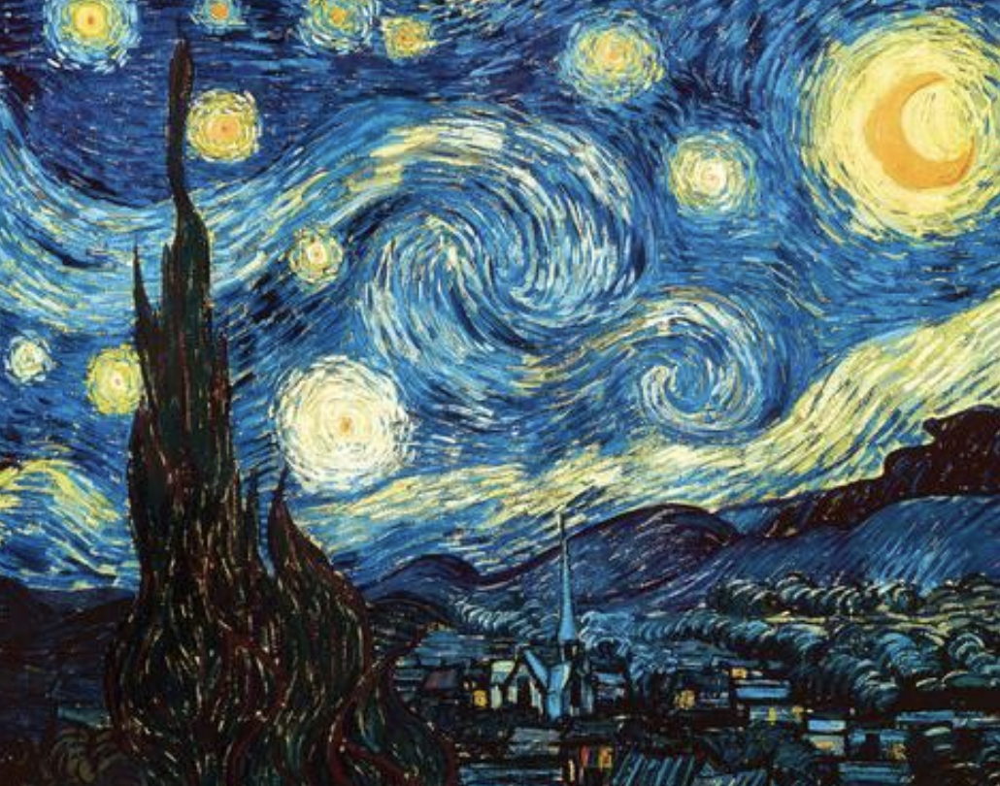 | 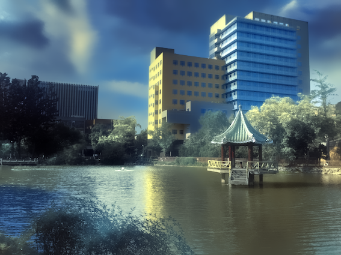 |
| 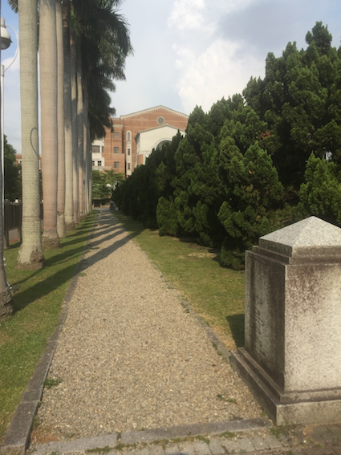 | 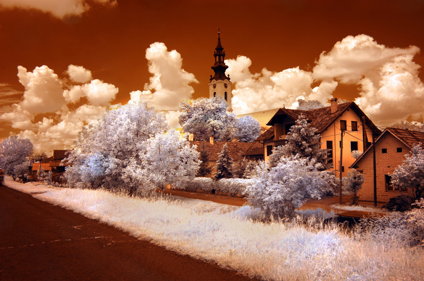 | 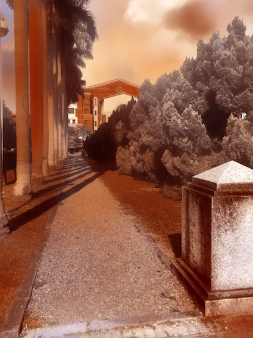 |
| 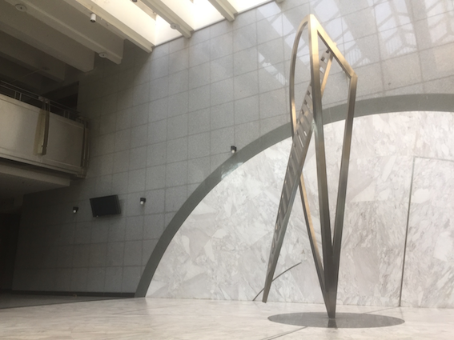 | 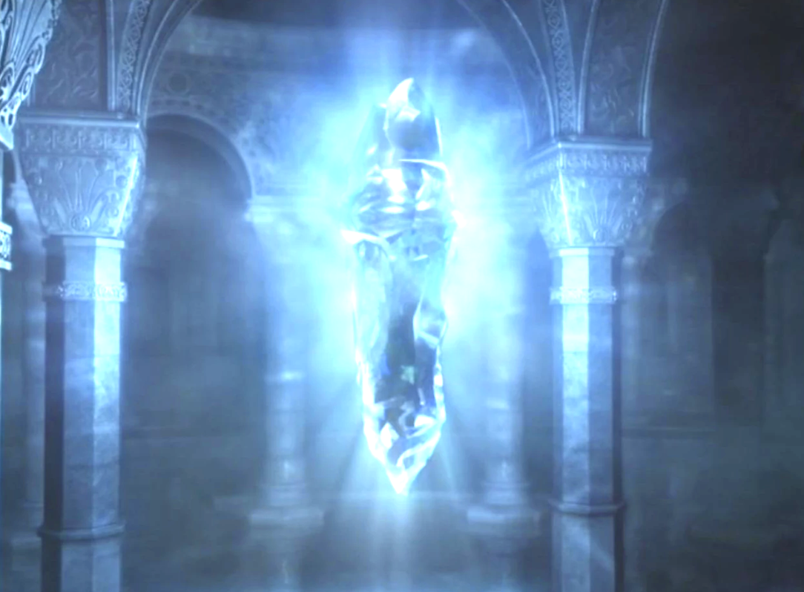 | 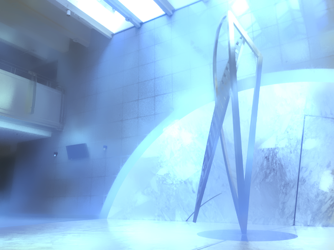 |
| 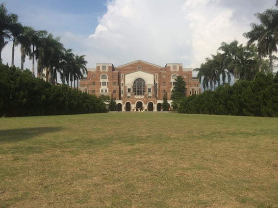 | 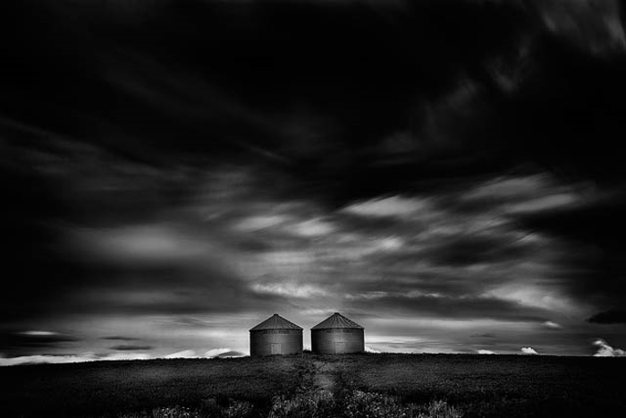 | 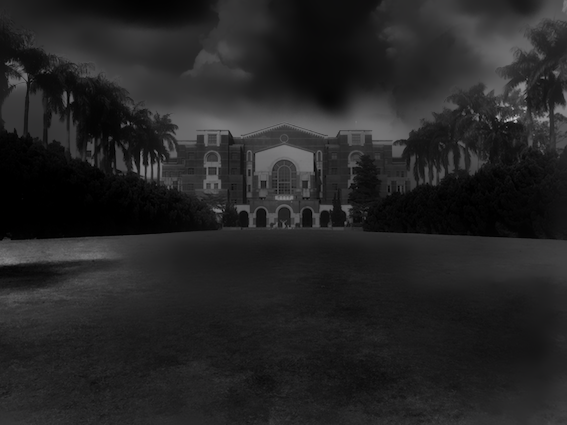 |


## How-to

```shell
$ ./docker.sh # enter into docker container
$ cd test_container
$ ./img.sh $(input_img_path) $(style_img_path)
$ ./demo.sh
```


### About

This code repository contains an implementation of our fast photorealistic style transfer algorithm. Given a content photo and a style photo, the code can transfer the style of the style photo to the content photo. The details of the algorithm behind the code is documented in our arxiv paper. Please cite the paper if this code repository is used in your publications.

[Yijun Li (UC Merced)](https://sites.google.com/site/yijunlimaverick/), [Ming-Yu Liu (NVIDIA)](http://mingyuliu.net/), [Xueting Li (UC Merced)](https://sunshineatnoon.github.io/), [Ming-Hsuan Yang (NVIDIA, UC Merced)](http://faculty.ucmerced.edu/mhyang/), [Jan Kautz (NVIDIA)](http://jankautz.com/) "[A Closed-form Solution to Photorealistic Image Stylization](https://arxiv.org/abs/1802.06474)" arXiv preprint arXiv:1802.06474


### Code usage

Please check out the [user manual page](USAGE.md).

### License

Copyright (C) 2018 NVIDIA Corporation.  All rights reserved.
Licensed under the CC BY-NC-SA 4.0 license (https://creativecommons.org/licenses/by-nc-sa/4.0/legalcode).

### 

